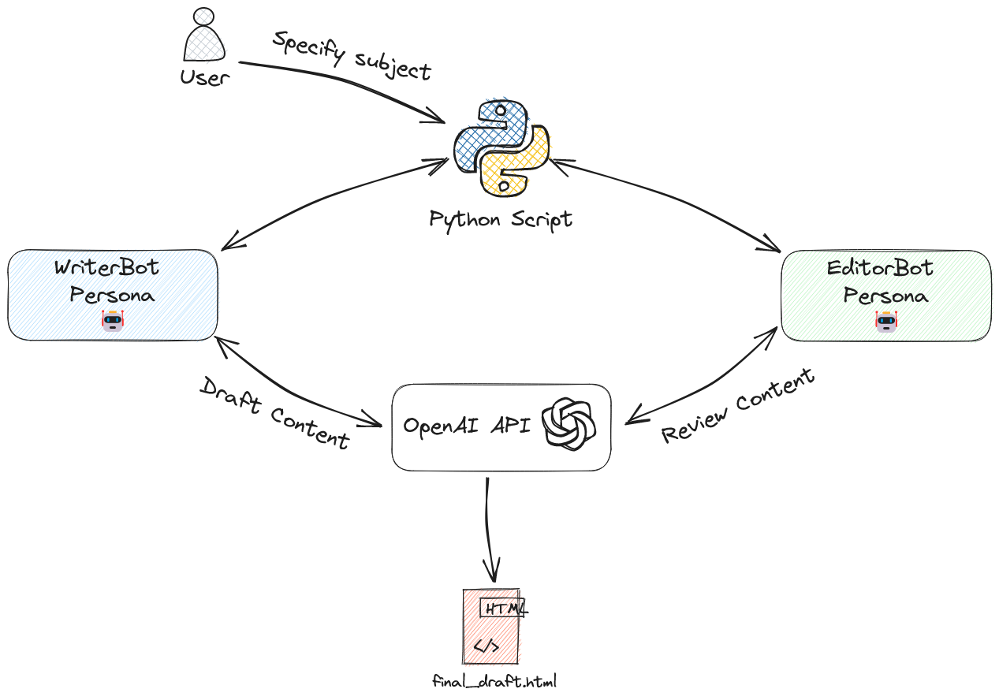

# BeebleBots

BeebleBots is a Python project that simulates a conversation between two AI personas: a writer bot and an editor bot. It leverages OpenAI's GPT-3.5-Turbo model to generate and revise content, mimicking the process of drafting and critiquing a piece of writing.



## Installation

Before running BeebleBots, make sure to install the necessary Python packages:

```
pip install -r requirements.txt
```

## Usage

Run the main script with the following command:

```
python main.py -k <path_to_api_key> -s "<subject>"
```

Replace `<path_to_api_key>` and `<subject>` with your own values.

Run `python main.py -h` to display all of the available command line arguments.

## Contributing

Pull requests are welcome. For major changes, please open an issue first to discuss what you would like to change.

## License

[MIT](https://choosealicense.com/licenses/mit/)